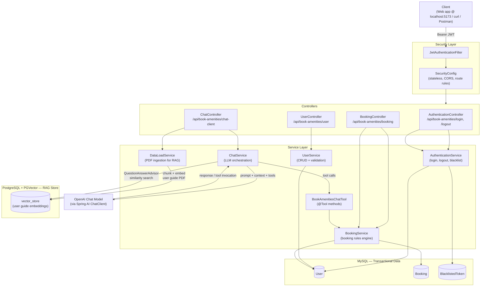

# Book-Amenities

A Spring Boot backend for managing amenity bookings in a gated community — JWT-secured REST APIs for users and bookings, plus an **AI chatbot** (Spring AI + tool calling + RAG) that lets residents book, view, or cancel amenities in natural language.

Built with Spring Boot 3.5, Spring Security, Spring AI 1.0, and a dual-datastore setup (MySQL for app data, PostgreSQL/PGVector for RAG).

---

## ✨ Features

- **JWT-based authentication** — stateless login/logout with a token blacklist so logged-out tokens can't be replayed.
- **Amenity booking management** — create, update, cancel, and list past/upcoming bookings, with rich business-rule validation (see below).
- **Booking business rules enforced server-side:**
  - No double-booking of the same amenity on the same day, and no overlapping time slots.
  - Sport courts (pool, badminton, basketball, table tennis) capped at 2 hours per booking and limited per week.
  - Guest Rooms have fixed Morning/Night/Full-day slots and a 3-per-month cap.
  - Convention Hall has fixed slots and a 2-per-year cap.
  - Bookings can't be created or deleted in the past, or after the slot has already started.
- **AI chatbot with tool calling** — residents can ask things like *"cancel my badminton booking #42"* or *"what are my upcoming bookings?"* in plain language; the LLM calls real backend tools (`get_past_bookings`, `get_upcoming_bookings`, `create_booking`, `cancel_booking`) to act on live data.
- **RAG-grounded answers** — a bundled user guide PDF is chunked and embedded into PGVector so the chatbot can also answer policy/FAQ questions (e.g. "how many times can I book the convention hall?") grounded in the actual document, via `QuestionAnswerAdvisor`.
- **Per-user conversation memory** — chat history keyed by `conversationId`, last 20 messages retained.
- **Dual datasource architecture** — MySQL for transactional app data (users, bookings, tokens), separate PostgreSQL/PGVector datasource purely for vector search, configured as independent Spring `DataSource`/`EntityManagerFactory` beans.
- **OpenAPI/Swagger UI** — interactive API docs available out of the box via springdoc-openapi.
- **Global exception handling** — consistent JSON error responses for validation failures, custom business exceptions, and constraint violations.

---

## 🏗️ Architecture



**Request flow — chatbot booking action (`POST /api/book-amenities/chat-client`)**

1. Client sends `{ "userId": "...", "query": "cancel booking 42", "bookingId": "42", "conversationId": "..." }`.
2. `ChatService` builds a system-style instruction embedding the user ID and booking ID, then calls the `ChatClient` with:
   - `MessageChatMemoryAdvisor` (conversation memory, scoped by `conversationId`)
   - `QuestionAnswerAdvisor` (RAG lookup against the PGVector store for policy/FAQ context)
   - `tools(bookAmenitiesChatTool)` (lets the model call real Java methods)
3. If the query maps to an action (cancel/create/list bookings), the model invokes the matching `@Tool` method in `BookAmenitiesChatTool`, which delegates to `BookingService` — the same validated business logic used by the REST API.
4. If the query is a policy/FAQ question, the `QuestionAnswerAdvisor` retrieves relevant chunks from the ingested user guide and grounds the answer.
5. The final natural-language response is returned to the client.

**Request flow — direct REST booking (`POST /api/book-amenities/booking`)**

1. Client sends a `BookingRequest` (amenity, date, slot/time, room).
2. `BookingService.validateBookingDetails()` resolves slot-based times (Guest Rooms/Convention Hall), then checks for overlaps, per-amenity duration caps, weekly/monthly/yearly booking limits, and past-date rules.
3. On success, the booking is persisted to MySQL and returned.

**Request flow — RAG data reload (`POST /api/book-amenities/chat-client/reload`)**

1. `DataLoadService` truncates the existing `vector_store` table, re-reads `book_amenities_user_guide.pdf` from the classpath, chunks it (1000-token chunks, 400-char minimum), and re-embeds it into PGVector.

---

## 🧰 Tech Stack

| Layer | Technology |
|---|---|
| Language / Runtime | Java 17 |
| Framework | Spring Boot 3.5.7, Spring Security, Spring Data JPA |
| AI Framework | Spring AI 1.0.0 (Chat Client, Tool Calling, RAG advisors, PGVector starter) |
| LLM Provider | OpenAI (`spring-ai-starter-model-openai`) |
| Primary Database | MySQL (users, bookings, token blacklist) |
| Vector Database | PostgreSQL + `pgvector` extension (RAG embeddings only) |
| Document Parsing | Spring AI PDF Document Reader |
| Auth | JWT (`io.jsonwebtoken` / jjwt), BCrypt password hashing |
| API Docs | springdoc-openapi (Swagger UI) |
| Build | Maven |

---

## 📡 API Reference

### Authentication — `/api/book-amenities`
| Method | Path | Auth | Description |
|---|---|---|---|
| POST | `/login` | Public | Returns `{ userId, token }` on valid credentials |
| POST | `/logout` | Bearer token | Blacklists the current token so it can't be reused |

### Users — `/api/book-amenities/user`
| Method | Path | Auth | Description |
|---|---|---|---|
| POST | `/` | Public | Register a new resident (unique username, unique flat+block) |
| GET | `/{userId}` | Bearer token | Fetch user details |
| DELETE | `/{userId}` | Bearer token | Delete a user (cascades to their bookings) |

### Bookings — `/api/book-amenities/booking`
| Method | Path | Auth | Description |
|---|---|---|---|
| POST | `/` | Bearer token | Create a booking (full business-rule validation) |
| GET | `/past/{userId}` | Bearer token | List completed/expired bookings |
| GET | `/upcoming/{userId}` | Bearer token | List future bookings |
| PUT | `/{bookingId}` | Bearer token | Update a booking |
| DELETE | `/{bookingId}/user/{userId}` | Bearer token | Cancel a booking (ownership + timing checks) |

### Chat — `/api/book-amenities/chat-client`
| Method | Path | Auth | Description |
|---|---|---|---|
| POST | `/` | Bearer token | Natural-language chat — can query/create/cancel bookings via tools, or answer policy questions via RAG |
| POST | `/reload` | Public | Re-ingests the bundled PDF user guide into the vector store |

**Example — login:**
```bash
curl -X POST http://localhost:8080/api/book-amenities/login \
  -H "Content-Type: application/json" \
  -d '{ "username": "asmith", "password": "yourpassword" }'
```

**Example — create a booking:**
```bash
curl -X POST http://localhost:8080/api/book-amenities/booking \
  -H "Authorization: Bearer <token>" \
  -H "Content-Type: application/json" \
  -d '{
        "userId": 1,
        "amenityName": "Badminton Court",
        "bookingDate": "15-08-2026",
        "startTime": "18:00",
        "endTime": "19:00"
      }'
```

**Example — chat with the AI assistant:**
```bash
curl -X POST http://localhost:8080/api/book-amenities/chat-client \
  -H "Authorization: Bearer <token>" \
  -H "Content-Type: application/json" \
  -d '{
        "userId": "1",
        "query": "What are my upcoming bookings?",
        "conversationId": "conv-123"
      }'
```

Interactive docs are also available at `http://localhost:8080/swagger-ui.html` once the app is running.

---

## ⚙️ Getting Started

### Prerequisites
- Java 17+
- Maven (or use the included `./mvnw` wrapper)
- MySQL (for app data)
- PostgreSQL with the [`pgvector`](https://github.com/pgvector/pgvector) extension (for RAG)
- An OpenAI API key

### 1. Set up the databases
```sql
-- MySQL
CREATE DATABASE bookamenities;

-- PostgreSQL
CREATE DATABASE bookamenities_rag_db;
\c bookamenities_rag_db
CREATE EXTENSION IF NOT EXISTS vector;
```

### 2. Configure environment variables
See `.env.example`:
```
DB_USERNAME=your_mysql_user
DB_PASSWORD=your_mysql_password
POSTGRES_DB_USERNAME=your_postgres_user
POSTGRES_DB_PASSWORD=your_postgres_password
OPENAI_API_KEY=sk-...
```

### 3. Run the application
```bash
./mvnw spring-boot:run
```

The app starts on `http://localhost:8080`. Schemas for both databases are created/updated automatically on startup (`ddl-auto=update`, `initialize-schema=true`). Once running, call `POST /api/book-amenities/chat-client/reload` once to ingest the bundled user guide PDF into the vector store before using RAG-based chat answers.

---

## 🗂️ Project Structure

```
src/main/java/com/app/bookamenities/
├── BookAmenitiesApplication.java     # Entry point
├── configuration/
│   ├── AIConfig.java                 # ChatClient + chat memory beans
│   ├── MySqlConfig.java              # Primary datasource (users, bookings)
│   ├── PgVectorConfig.java           # Secondary datasource (RAG vector store)
│   └── SecurityConfig.java           # JWT filter chain, CORS, route rules
├── controller/
│   ├── AuthenticationController.java
│   ├── UserController.java
│   ├── BookingController.java
│   └── ChatController.java
├── service/
│   ├── AuthenticationService.java    # Login/logout + token blacklist
│   ├── UserService.java              # User CRUD + validation
│   ├── BookingService.java           # Booking rules engine
│   ├── ChatService.java              # LLM orchestration (memory + RAG + tools)
│   ├── BookAmenitiesChatTool.java    # @Tool-annotated methods the LLM can call
│   └── DataLoadService.java          # PDF ingestion into PGVector
├── security/
│   ├── JwtUtil.java                  # Token generation/validation
│   └── JwtAuthenticationFilter.java  # Per-request auth filter
├── entity/                           # User, Booking, BlacklistedToken (JPA)
├── repository/                       # Spring Data repositories
├── dto/                              # Request/response payloads
└── exception/                        # Custom exceptions + global handler
src/main/resources/
├── application.properties
└── docs/book_amenities_user_guide.pdf  # Source document for RAG
```

---

## ⚠️ Known Limitations / Roadmap

- **JWT secret is currently hardcoded in `JwtUtil.java`** — move this to an environment variable (`JWT_SECRET`) before deploying anywhere public; a hardcoded signing key is a real security risk, not just a style nit.
- CORS is currently locked to `http://localhost:5173` — fine for local frontend development, but needs to be externalized/configurable per environment.
- No role-based authorization yet — any authenticated user can hit any authenticated endpoint (no admin vs. resident distinction).
- Chat memory is in-memory only (`InMemoryChatMemoryRepository`) — lost on restart, doesn't scale across multiple instances.
- SMS notifications (`BookingService.sendSms`) are stubbed out / commented out — AWS SNS integration was started but not wired in.
- No automated tests beyond the default Spring Boot context load test.
- Planned: role-based access control, persisted chat memory, containerization (Dockerfile + docker-compose for MySQL + Postgres/pgvector), CI pipeline.

---

## 📄 License

MIT — feel free to use this as a reference implementation for your own Spring AI tool-calling + RAG projects.
